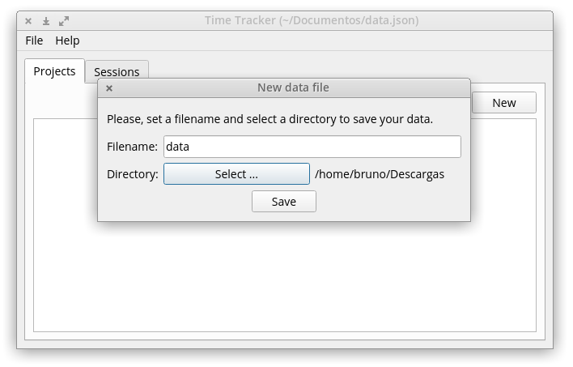

  

#### How to use:

1) Create your data file or open an existing one.

2) Create projects/tasks you want to work on. Once created every task is marked as started.

3) Edit (rename) or remove tasks as you please.

4) Start/Stop your working sessions.

