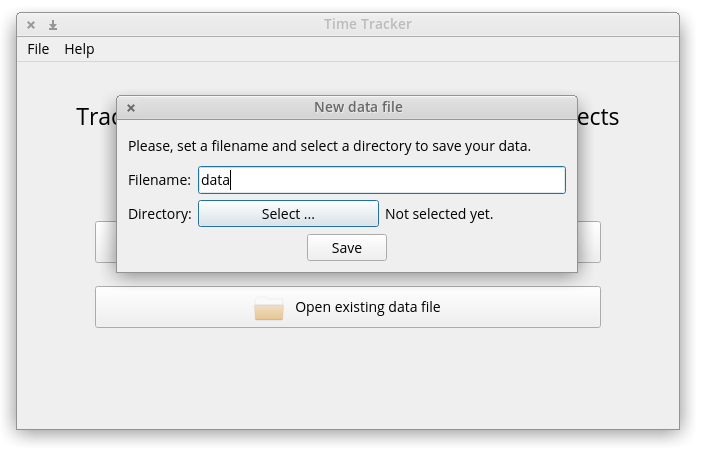

  

#### What is Time tracker?

Time tracker is a GUI version of the script called [time-tracker-cli](https://github.com/pazitos10/time-tracker-cli).

#### Dependencies

* `PyQt5`
* `time-tracker-cli`
* `Pandas`
* `Plotly`

Install them via: `pip install -r requirements.txt`

#### How to use:

The binary version is not available yet but you can run it manually anyway: `python app.py`

1) Create your data file or open an existing one.

  
  

2) Create projects/tasks you want to work on. Once created, every task is marked as started.

  

3) Edit (rename) or remove tasks as you please.

  

4) Start/Stop your working sessions.

  

  

5) Data is stored in a JSON file.   

6) View a visual report of "Work done per project" by clicking on `Report>Projects Chart` from the Menu Bar. The chart is displayed on your default browser.

7) View a visual report of "Daily Work Done" by clicking on `Report>Time-Series Chart` from the Menu Bar. The chart is displayed on your default browser. Show/hide projects on the chart by clicking once on its legend entry. Isolate/deisolate projects on the chart by double-clicking on its legend entry.

8) Interact with the reports and export them:
   - Plots can be exported as png.
   - Plots can be panned and zoomed.
   - Plots have tooltips on mouse hover. Try hovering over different bars on the plot to reveal additional info.
   - For more info regarding functionality of the plots see [Plotly](https://plotly.com/python/) documentation.
  

#### TODO

 - [x] Clean and document the code.
 - [ ] Create binary versions.
 - [ ] Redesign logo.
 - [ ] (Optional) replace text in buttons with icons.
